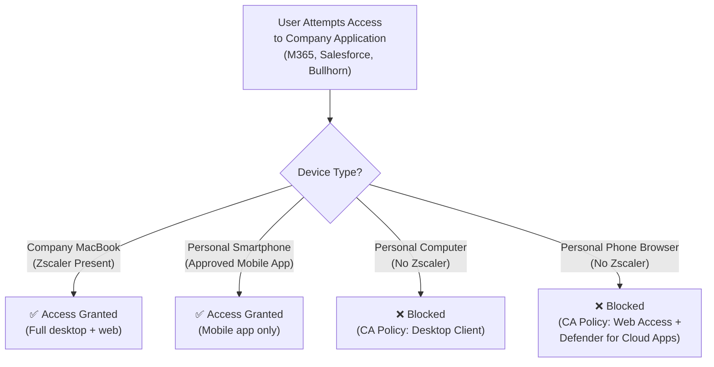
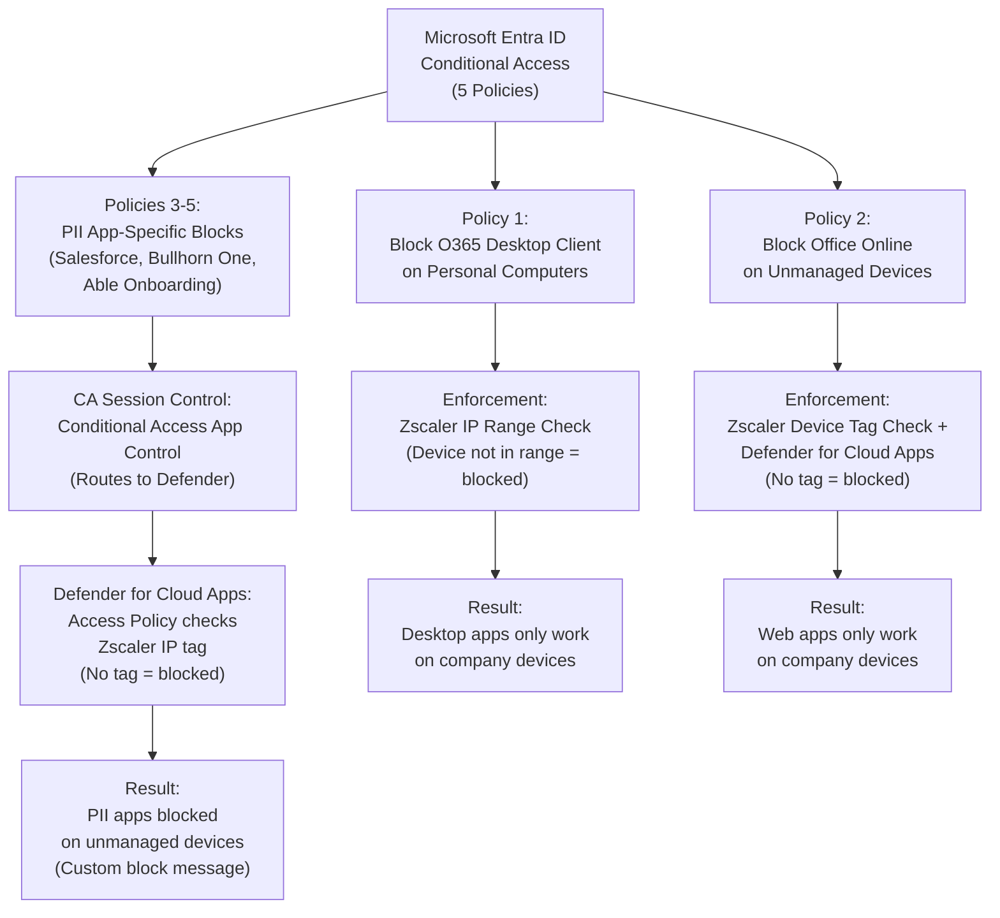
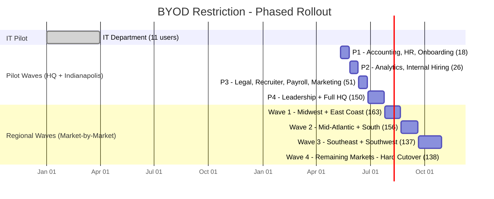

# BYOD Restriction & Conditional Access Deployment

**Domain:** Security & Access Policy  
**Role:** Technical Lead & Rollout Architect  
**Timeline:** IT pre-pilot completed 2025; official pilot launched May 12, 2026; full rollout May–October 2026  

---

## Overview

Designed and implemented a BYOD restriction initiative using Microsoft Entra ID Conditional Access policies and Microsoft Defender for Cloud Apps to restrict access to company applications - Microsoft 365, Salesforce, Bullhorn - to company-managed devices and approved mobile apps only. Personal/unmanaged devices are blocked from accessing work resources through web browsers or desktop applications. Leading the phased rollout across 849 users with a structured pilot program, regional wave deployment, and change management plan.

---

## At a Glance

| Metric | Detail |
|---|---|
| Users In Scope | 849 (8 phases, post-IT pilot) |
| Rollout Duration | May 2026 – October 2026 |
| Pilot Phases | 4 department-based phases (P1–P4) |
| Regional Waves | 4 geographic waves (W1–W4) |
| Hard Cutover Deadline | October 30, 2026 |
| Conditional Access Policies | 5 (desktop block + web block + 3 app-specific PII blocks) |
| Enforcement Layer | Zscaler device presence + Conditional Access + Defender for Cloud Apps |
| IT Pre-Pilot | Completed (11 users, running for ~1 year) |
| New Tools Required | None - built on existing security stack |

---

## Architecture

---

## Policy Design

---

## Rollout Timeline

---

## Rollout Wave Summary

| Wave | Description | Emails Out | Cutover Date | Users |
|---|---|---|---|---|
| IT (Complete) | IT department - already rolled out | - | Completed 2025 | 11 |
| P1 | Pilot: Accounting, HR, Onboarding | May 5 | May 12, 2026 | 18 |
| P2 | Pilot: Analytics, Internal Hiring, Corporate | May 20 | May 27, 2026 | 26 |
| P3 | Pilot: Legal, Recruiter, Payroll, Marketing | Jun 4 | Jun 11, 2026 | 51 |
| P4 | Pilot: Leadership + Full HQ | Jun 18 | Jun 27, 2026 | 150 |
| Wave 1 | Midwest + East Coast (6 markets) | Jul 1 | Jul 25, 2026 | 163 |
| Wave 2 | Mid-Atlantic + South (6 markets) | Aug 1 | Aug 22, 2026 | 156 |
| Wave 3 | Southeast + Southwest (7 markets) | Sep 1 | Sep 20, 2026 | 137 |
| Wave 4 | Remaining markets - hard cutover (19 markets) | Oct 1 | Oct 30, 2026 | 138 |
| **Total** | | | | **849** |

---

## Tools & Technologies

| Category | Technology |
|---|---|
| Access Policy | Microsoft Entra ID Conditional Access |
| Cloud App Security | Microsoft Defender for Cloud Apps |
| Network Enforcement | Zscaler (IP range + device tag verification) |
| Endpoint Management | Jamf Pro (macOS), Microsoft Intune |
| Applications in Scope | Microsoft 365, Salesforce, Bullhorn |
| Change Management | Phased rollout plan, multi-channel communication, white-glove support |

---

## Screenshots

*All screenshots have been redacted to remove organization names, support URLs, and user-specific details.*

### Conditional Access Policy List

*Five BYOD Conditional Access policies covering O365 desktop client blocking, Office web blocking, and app-specific PII access restrictions for Salesforce, Bullhorn One, and Able Onboarding.*

### Conditional Access Policy - O365 Desktop Client Block (Client Apps)

*O365 desktop client block policy targeting "Mobile apps and desktop clients" only (Browser excluded), with Grant set to Block access. Selectively blocks desktop app access while leaving browser enforcement to the separate Office Online policy.*

### Conditional Access Policy - O365 Desktop Client Block (Device Platforms)

*Same policy showing device platform conditions: Windows and macOS included, mobile platforms (Android, iOS) excluded. Personal phones running official mobile apps are not affected by this policy.*

### Conditional Access Policy - PII App Block (Entra ID)

*Conditional Access policy for Salesforce PII users showing session controls routing traffic through Conditional Access App Control to Microsoft Defender for Cloud Apps.*

### Defender for Cloud Apps - Access Policy

*Microsoft Defender for Cloud Apps access policy showing enforcement logic: if IP address tag does not equal Zscaler AND app equals Salesforce, action is Block with a custom message directing users to their company-provided device.*

### Block Message - End User Experience

*Custom block message displayed to users attempting to access a restricted application from an unmanaged device, enforced by Microsoft Defender for Cloud Apps.*

---

<strong>Click to expand full implementation breakdown</strong>

### Problem Statement

Company and client data could be accessed from any personal, unmanaged device - a significant security gap. Employees could log into Microsoft 365, Salesforce, and Bullhorn from personal computers or phone browsers with no IT visibility or control over those endpoints. This created risk of:

- **Data leakage** - sensitive company and client data accessible on devices IT cannot manage or wipe
- **Unauthorized access** - no device compliance verification at sign-in
- **Compliance exposure** - inability to demonstrate endpoint control to clients and auditors
- **Shadow IT** - users working from personal devices outside the managed security stack (Jamf Pro, Jamf Protect, Zscaler)

### Phase 1 - Policy Design & IT Pilot (2025)

- Designed five Conditional Access policies in Microsoft Entra ID:
  - **Block O365 Desktop Client on Personal Computers** - blocks desktop application access for devices not within the Zscaler IP range, ensuring only company-managed devices with Zscaler Client Connector can access desktop apps
  - **Block Office Online (Websites) on Unmanaged Devices** - blocks web-based access to Office apps for devices without the Zscaler device tag, enforced in tandem with a Defender for Cloud Apps access policy
  - **PII Users in Salesforce** - Conditional Access session control routes Salesforce traffic through Conditional Access App Control to Defender for Cloud Apps, which blocks access if the Zscaler IP tag is not present
  - **PII Users in Bullhorn One** - same enforcement pattern as Salesforce, applied to Bullhorn One
  - **PII Users in Able Onboarding** - same enforcement pattern as Salesforce, applied to Able Onboarding
- Configured Microsoft Defender for Cloud Apps access policies for each PII app - these work in tandem with the Conditional Access session controls to evaluate Zscaler device presence and block access with a custom user-facing message directing them to use their company-provided device
- The enforcement model hinges on Zscaler presence: company-managed devices have the Zscaler Client Connector installed (deployed via Jamf Pro), which provides both the IP range and device tag that Conditional Access evaluates
- Personal smartphones are permitted to access work apps through official mobile apps only (Outlook, Teams, Salesforce mobile, etc.) - browser access on phones is blocked
- Deployed to the IT department (11 users) as the pilot group and ran in production for approximately one year to validate policy behavior and identify edge cases
- Tested across multiple scenarios: company MacBook, personal computer, personal phone browser, official mobile apps, VPN scenarios, and remote access

### Phase 2 - Rollout Strategy Design (Q1–Q2 2026)

- Designed a phased rollout structure with department-based pilot waves before geographic expansion:
  - **Department-based pilots (P1–P4)** target HQ and Indianapolis first, building operational confidence across different functional areas before any field market sees the change
  - **Geographic waves (W1–W4)** roll market-by-market after pilots validate cleanly
  - **Leadership consolidated into P4** so executives experience the change before approving communications for their teams
  - **Hard cutover at Wave 4** (October 30, 2026) prevents indefinite slippage
- Structured the wave breakdown with user counts, email-out dates, and cutover dates for each phase
- Identified BYOD-dependent users (employees currently accessing work apps from personal devices) for proactive white-glove outreach before their cutover wave
- Collaborated with a Project Manager on change management communications: initial announcement, targeted outreach to affected users, reminder messages, and final cutover notices
- Communication strategy uses 7+ touchpoints per wave across multiple channels (email, Teams, internal platforms, leadership cascade) before each cutover

### Phase 3 - Pilot Execution (May–June 2026)

- P1 (May 12): Accounting, HR, Onboarding - 18 users
- P2 (May 27): Analytics, Internal Hiring, Corporate - 26 users
- P3 (Jun 11): Legal, Recruiter, Payroll, Marketing - 51 users
- P4 (Jun 27): Leadership + full HQ + regional office - 150 users
- Each wave includes pre-cutover communication, cutover enforcement, and post-cutover monitoring
- Providing direct support and troubleshooting for any access issues during each pilot phase
- White-glove service for users identified as currently dependent on personal devices - ensuring they have a company-provided MacBook before their cutover date

### Phase 4 - Regional Rollout (July–October 2026)

- Wave 1 (Jul 25): Midwest + East Coast - 163 users across 6 markets
- Wave 2 (Aug 22): Mid-Atlantic + South - 156 users across 6 markets
- Wave 3 (Sep 20): Southeast + Southwest - 137 users across 7 markets
- Wave 4 (Oct 30): Remaining 19 markets - 138 users - hard cutover, no extensions

### Rollout Design Rationale

- Department-based pilots build operational confidence across different functions before geographic expansion
- Sequencing P1 → P4 provides 4 opportunities to refine messaging and support processes before any field market is affected
- Regional waves reduce communication complexity compared to per-market individual deadlines and align with existing market leadership structure
- Consolidating leadership into P4 ensures executives experience the change firsthand before approving rollout communications for their teams
- Hard cutover at Wave 4 prevents indefinite slippage and forces resolution on holdout cases

---

## Results & Impact

*This initiative is currently in pre-launch, with pilot waves beginning May 2026. Results will be updated as the rollout progresses.*

**Completed to date:**
- **5 Conditional Access policies designed, tested, and validated** - 2 broad O365 policies plus 3 app-specific PII policies (Salesforce, Bullhorn One, Able Onboarding) with Defender for Cloud Apps enforcement, running in IT pre-pilot for ~1 year with zero production issues
- **849-user rollout plan** structured across 8 phases with defined cutover dates, communication cadences, and escalation procedures
- **BYOD-dependent users identified** and queued for proactive white-glove device provisioning before their cutover wave
- **No new tools or licenses required** - built entirely on the existing security stack (Entra ID, Defender for Cloud Apps, Zscaler, Jamf Pro)

**Expected outcomes post-rollout:**
- **Company and client data restricted** to IT-managed endpoints and approved mobile apps only
- **Personal computer and phone browser access eliminated** across all 849 in-scope users by October 30, 2026
- **Compliance posture strengthened** with demonstrable endpoint control for client and audit requirements
- **Zero-trust access model advanced** - Zscaler device presence + Conditional Access + Defender for Cloud Apps enforcing access at the network, identity, and application layers

---

[← Back to Portfolio](../README.md)
