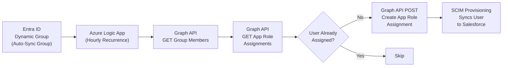

# Salesforce SCIM Provisioning & Logic App — Production Implementation Guide

**Domain:** Identity & Access Management — Automation  
**Author:** Nick Tavassoli, IT Operations  
**Status:** In Progress  

---

## Context

Salesforce's SCIM connector in Microsoft Entra ID only supports direct user assignment — it does not accept group-based provisioning scopes. This means every user must be individually assigned to the Enterprise Application before SCIM can provision them, making automated lifecycle management impractical at scale.

This implementation guide documents the Azure Logic App solution designed to bridge this gap: the Logic App reads a dynamic Entra ID group, compares membership against current Enterprise App assignments, and automatically creates app role assignments via the Microsoft Graph API for any missing users — triggering SCIM provisioning without manual per-user assignment.

---

## Architecture



---

## Schedule Overview

| When | Steps | What Happens |
|---|---|---|
| **Business Hours** | Steps 1–6 | Verify SCIM config, build Logic App, grant permissions, build workflow, confirm working with single-user test. No user impact. |
| **Weekend 1 — Off Hours** | Steps 7–8 | Remove group assignments, toggle Assignment Required off briefly, run Logic App, validate all users re-added, toggle back on, Provision on Demand tests. Monitor SSO for one week. |
| **Weekend 2 — Off Hours** | Step 9 | Enable SCIM provisioning — only after confirming no SSO issues during the monitoring week. |

---

## IDs to Collect Before Starting

| Resource | Where to Find It |
|---|---|
| Production Tenant ID | Any App Registration → Overview |
| Enterprise App Object ID | Entra ID → Enterprise Apps → Target App → Properties |
| Auto Sync Group Object ID | Entra ID → Groups → Target Dynamic Group |
| Standard Platform User App Role ID | Queried via Graph API in Step 4 |
| Logic App Managed Identity Object ID | Logic App → Identity → System assigned |

---

## Step 1 — Verify SCIM Configuration (Do Not Enable Yet)

1. Entra ID → Enterprise Apps → Target App → Provisioning
2. Confirm: Provisioning Mode = Automatic
3. Confirm: Tenant URL and Secret Token saved — Test Connection shows green
4. Confirm: Matching attribute = `userName` with Matching Precedence = 1
5. Confirm: `ProfileName` attribute mapping is set to "Only during object creation"
6. Confirm: Provisioning Status is **Off** — leave it off until Step 9

> ℹ️ SCIM will not be enabled until Step 9, after the one-week monitoring period following Weekend 1.

---

## Step 2 — Create the Logic App

1. Azure Portal → Create a resource → Logic App → Create
2. Plan type: **Consumption** (not Standard)
3. Name: `LA-[AppName]-UserSync-Prod` → Create → Go to resource
4. Settings → Identity → System assigned → toggle **On** → Save
5. Copy the Object (principal) ID — record it in the IDs table

---

## Step 3 — Grant Graph API Permissions to the Managed Identity

Run the following in Azure Cloud Shell (PowerShell):

```powershell
$ManagedIdentityObjectId = "{OBJECT_ID_FROM_STEP_2}"
$GraphAppId = "00000003-0000-0000-c000-000000000000"
$GraphSP = Get-MgServicePrincipal -Filter "appId eq '$GraphAppId'" -Property "Id,AppRoles"

$Permissions = @(
    "Application.Read.All",
    "AppRoleAssignment.ReadWrite.All",
    "Directory.Read.All",
    "Group.ReadWrite.All",
    "GroupMember.ReadWrite.All",
    "User.Read.All"
)

foreach ($Permission in $Permissions) {
    $Role = $GraphSP.AppRoles | Where-Object { $_.Value -eq $Permission }
    if ($null -eq $Role) { Write-Host "WARNING: Not found: $Permission"; continue }
    New-MgServicePrincipalAppRoleAssignment `
        -ServicePrincipalId $ManagedIdentityObjectId `
        -PrincipalId $ManagedIdentityObjectId `
        -ResourceId $GraphSP.Id `
        -AppRoleId $Role.Id
}
```

After running:
1. Entra ID → Enterprise Apps → search your Logic App name → Permissions
2. Confirm all 6 permissions appear under Admin consent

---

## Step 4 — Get the App Role ID

Make a GET call in Graph Explorer, Postman, or Cloud Shell:

```
GET https://graph.microsoft.com/v1.0/servicePrincipals/{Enterprise-App-Object-ID}/appRoles
```

1. Find the entry where `"displayName": "Standard Platform User"`
2. Copy that entry's `id` value — record it in the IDs table

---

## Step 5 — Build the Logic App Workflow

Open Logic App designer → Blank template → build in this order:

**Trigger — Recurrence**
- Interval: 1, Frequency: Hour

**Action 1 — Get Group Members (HTTP GET)**
- URI: `https://graph.microsoft.com/v1.0/groups/{Auto-Sync-Group-Object-ID}/members`
- Authentication: Managed Identity | Audience: `https://graph.microsoft.com`

**Action 2 — Parse Group Members (Parse JSON)**
- Content: Body from Action 1

**Action 3 — Get App Assignments (HTTP GET)**
- URI: `https://graph.microsoft.com/v1.0/servicePrincipals/{Enterprise-App-Object-ID}/appRoleAssignedTo`
- Authentication: Managed Identity | Audience: `https://graph.microsoft.com`

**Action 4 — Parse App Assignments (Parse JSON)**
- Content: Body from Action 3

**Action 5 — For Each Loop**
- Iterate over group members from Action 2
- Condition: does this user's ID exist in app assignments from Action 4?
- **If False — HTTP POST:**
  - URI: `https://graph.microsoft.com/v1.0/servicePrincipals/{Enterprise-App-Object-ID}/appRoleAssignedTo`
  - Headers: `Content-Type = application/json`
  - Authentication: Managed Identity | Audience: `https://graph.microsoft.com`
  - Body:
    ```json
    {
      "principalId": "@{items('For_each')?['id']}",
      "resourceId": "{Enterprise-App-Object-ID}",
      "appRoleId": "{Standard-Platform-User-App-Role-ID}"
    }
    ```
- **If True:** do nothing

> ⚠️ The HTTP POST inside the If False branch must have `runAfter` set to `{}` (empty). If it points to the Condition it will fail validation.

Save the Logic App.

---

## Step 6 — Test the Logic App (Single User)

Confirm the Logic App works before the weekend with a controlled single-user test. Assignment Required stays On the entire time — no other users are affected.

1. Pick a test user who is in the Auto Sync group and currently assigned to the Enterprise App
2. Entra ID → Enterprise Apps → Target App → Users and Groups → remove that one user
3. Logic App → Run Trigger → Run
4. Return to Users and Groups — confirm the user reappears with Standard Platform User role

> ℹ️ The test user will lose SSO access briefly between removal and the Logic App run completing — typically under 2 minutes.

---

## Step 7 — Full Assignment Migration (Weekend 1 — Off Hours)

> ⚠️ Assignment Required will be Off during sub-steps 3–6. All Entra ID users will have SSO access to the target app during this window. Move quickly.

1. Screenshot the current Users and Groups list — this is your baseline
2. Remove all group assignments from Users and Groups (leave individual user assignments)
3. Properties → toggle **Assignment Required to No** → Save
4. Logic App → Run Trigger → Run
5. Return to Users and Groups — confirm all Auto Sync group members have been added as individual assignments with Standard Platform User role
6. Cross-check against your baseline screenshot
7. Properties → toggle **Assignment Required back to Yes** → Save
8. Monitor SSO access over the following week before proceeding to Weekend 2

---

## Step 8 — Provision on Demand Testing (Weekend 1)

Run immediately after Step 7 in the same window.

1. Provisioning → Provision on demand
2. Test 3–5 users — mix of existing target app users and new ones
3. **Existing users:** confirm result = Matched, action = Update, no role change
4. **New users:** confirm result = Created, role = Standard Platform User
5. Do not proceed to Weekend 2 until all tests pass and the monitoring week is clear

---

## Step 9 — Enable SCIM Provisioning (Weekend 2 — Off Hours)

> ℹ️ Only perform this step after confirming no SSO issues during the one-week monitoring period following Weekend 1.

1. Confirm: Scope = Sync only assigned users and groups
2. Provisioning → toggle **Provisioning Status to On**
3. Monitor Provisioning Logs after the first cycle runs (20–40 minutes)
4. Expected results:
   - Existing users — action = Update, no role change
   - New users — action = Created, role = Standard Platform User
   - No unexpected failures

---

## SCIM Attribute Mapping Reference

| Salesforce Attribute | Entra ID Source | Notes |
|---|---|---|
| Username | `userPrincipalName` | Matching attribute — used to link accounts |
| IsActive | `Not([IsSoftDeleted])` | Deactivates in Salesforce if soft-deleted in Entra |
| Alias | `Mid([userPrincipalName], 1, 8)` | Auto-generated from UPN |
| Email | `Coalesce([mail], [userPrincipalName])` | Uses mail, falls back to UPN |
| FirstName | `givenName` | — |
| LastName | `surname` | — |
| ProfileName | `SingleAppRoleAssignment([appRoleAssignments])` | Only set at account creation — not updated for existing users |
| FederationIdentifier | `userPrincipalName` | Used for SSO linking |

> ℹ️ SCIM only manages users provisioned through Entra ID. Natively-created accounts — including service accounts and integration users — are completely unaffected.

---

[← Back to SSO + SCIM Identity Automation](../projects/sso-scim-identity-automation.md)
