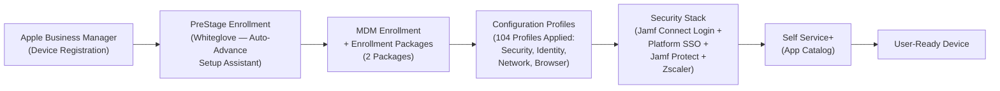
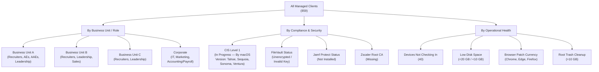
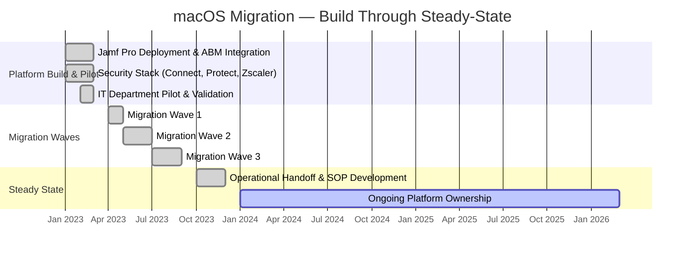

# Jamf Pro MDM Deployment

**Domain:** Endpoint Management  
**Role:** Platform Owner & Technical Lead  
**Timeline:** Q1 2023 – Q4 2023 (build through steady-state), ongoing platform ownership  

---

## Overview

Built an enterprise Jamf Pro MDM environment from the ground up to support a full-scale migration from Windows to macOS. This initiative converted a Microsoft Intune managed device fleet to a centrally governed macOS environment, enabling standardized configuration, automated enrollment, and policy-driven endpoint security across ~850 users.

---

## Environment

- **User base:** ~850 employees across multiple offices and business units
- **Prior state:** Primarily Windows devices managed through Microsoft Intune
- **Target state:** Managed macOS fleet enrolled in Jamf Pro with standardized configuration profiles and automated device lifecycle
- **Identity provider:** Microsoft Entra ID
- **Security stack:** Jamf Connect (cloud identity binding + Platform SSO), Jamf Protect (endpoint threat prevention with tiered security plans), Zscaler (network security + ZTNA)
- **Compliance context:** HITRUST i1 certification in progress concurrently; CIS Level 1 benchmark adoption in progress

---

## Problem Statement

The organization operated a Windows-based device fleet managed through Microsoft Intune. As the business evaluated macOS adoption for its workforce, there was no existing Apple MDM infrastructure, no Apple Business Manager integration, and no standardized process for macOS provisioning, configuration, or policy enforcement. The IT team needed to:

- Stand up an MDM platform capable of managing macOS at enterprise scale
- Design a zero-touch enrollment workflow for new device deployments
- Establish security baselines for encryption, firewall, device restrictions, and software update enforcement
- Integrate cloud identity, endpoint security, and network security tooling into the managed macOS environment
- Coordinate a phased migration that minimized end-user disruption across multiple business units

---

## Implementation

### Phase 1 — Platform Build-Out & Pilot (Q1 2023)

- Deployed Jamf Pro as the MDM authority for test macOS devices
- Integrated with Apple Business Manager (ABM) for automated device enrollment
- Configured PreStage Enrollment profiles ("Whiteglove") to enable zero-touch provisioning with automatic Setup Assistant advancement, configuration profile delivery, and enrollment package installation at first boot
- Established identity integration with Microsoft Entra ID for directory-based scoping
- Deployed Jamf Connect for cloud identity binding at the macOS login window, enabling users to authenticate with Entra ID credentials at login
- Configured Platform SSO via a managed SSO Extension profile — enabling single sign-on across Microsoft 365 apps (Outlook, Teams, OneDrive, Word, Excel, PowerPoint, OneNote) and Zscaler with a single login window authentication
- Deployed Jamf Protect for endpoint threat prevention with tiered security plans scoped to different groups based on security control requirements (e.g., IT, Marketing, general population)
- Deployed Zscaler client connector and root CA certificate for network security and web filtering on managed devices
- Piloted with IT department devices to validate the full enrollment-to-production pipeline end-to-end

### Phase 2 — Configuration & Policy Design

Built and deployed 104 configuration profiles across the fleet, organized into functional categories:

**Security Baselines:**
- **FileVault** — Full-disk encryption enforced across all managed clients, with FileVault recovery key redirection to Jamf Pro for escrowed key management
- **Firewall Settings** — macOS firewall enabled fleet-wide
- **Login Window** — Screen lock and login window hardening enforced across all devices
- **Device Restrictions** — Gatekeeper restricted to Mac App Store and identified developers, guest user and "Other" login options disabled, Game Center restricted
- **Nudge** — macOS software update enforcement tool deployed via paired configuration profile and policy, prompting users to update to the target macOS version on a managed schedule

**Identity & SSO:**
- **Jamf Connect License, Settings, and Login** — Three profiles managing Jamf Connect deployment, configuration, and the cloud identity login window experience
- **SSO Plugin** — Platform SSO extension enabling seamless authentication into Microsoft 365 and Zscaler after a single login window sign-in

**Network & Security Agents:**
- **Zscaler Root CA Install** — Root certificate deployment to all managed clients for Zscaler traffic inspection
- **Zscaler Custom Settings** — Client connector configuration for network security policy enforcement

**Endpoint Protection:**
- **Jamf Protect** — Tiered security plans deployed to different populations:
  - IT Security Plan — Scoped to Information Technology (9 devices)
  - Marketing Security Plan — Scoped to Marketing (16 devices)
  - Security Profile Plan — General population baseline (816 devices)

**Software & Browser Management:**
- **Microsoft OneDrive and Documents Backup** — Deployed to all managed clients for cloud file sync
- **Microsoft Teams PPPC and Notifications** — Privacy preference and notification management for Teams
- **Browser extension profiles** — 1Password and managed Edge extensions deployed to targeted groups based on business unit and role
- **Browser updaters** — Firefox and Edge update management profiles scoped to devices with outdated versions

**Network:**
- **WiFi configuration** — Corporate WiFi profile deployed to all managed clients

**Dynamic Device Segmentation (Smart Groups):**
- Created 70+ Smart Groups for dynamic segmentation across business units and roles (Recruiters, Account Executives, Leadership, Sales, IT, Marketing, Accounting/Payroll), compliance status, and operational health
- Built operational monitoring groups: devices with low disk space, devices not checking in, FileVault encryption status, Jamf Protect installation status, Zscaler root CA presence, and browser patch currency (Chrome, Edge, Firefox)

**Self Service+:**
- Curated Self Service+ app catalog providing end users with on-demand access to approved applications (Google Chrome, Microsoft Edge, Microsoft 365 suite, Slack, Zoom, Webex, Grammarly, and others) without IT intervention

### Phase 3 — Migration Execution (Q2–Q3 2023)

- Coordinated migration waves across business units and departments, working with team leads and IT staff to schedule transitions
- Delivered standardized provisioning kits/workflows so new macOS devices arrived ready to enroll out of the box via the Whiteglove PreStage
- Validated that Jamf Connect, Jamf Protect, Zscaler, and all configuration profiles deployed successfully on each device post-enrollment
- Provided escalation support during migration waves to minimize downtime
- Tracked enrollment progress and compliance posture through Jamf Pro dashboards and Smart Groups

### Phase 4 — Steady-State Operations (Q4 2023 – Present)

- Established monitoring and alerting for enrollment failures, policy non-compliance, and certificate expiration
- Built SOPs for device provisioning, decommissioning, and lost/stolen device response
- Transitioned ongoing platform operations and help desk triage workflows to the support team
- Continue to manage and evolve Jamf Pro as platform owner — adding new profiles, refining security baselines (CIS Level 1 adoption in progress), and adjusting policies as the fleet and security requirements evolve
- Led 1Password password manager rollout to select HQ departments (IT, Accounting, Payroll) via managed browser extension profiles

---

## Architecture

```
┌─────────────────────────────────────────────────────────┐
│                  Apple Business Manager                   │
│              (Device Enrollment Program)                  │
└──────────────────────┬──────────────────────────────────┘
                       │ Automated Enrollment
                       ▼
┌─────────────────────────────────────────────────────────┐
│                      Jamf Pro                            │
│          104 Configuration Profiles Managed              │
│                                                         │
│  ┌──────────────┐  ┌──────────────┐  ┌───────────────┐  │
│  │ PreStage     │  │ Security     │  │ Smart Groups  │  │
│  │ Enrollment   │  │ Baselines    │  │ (70+)         │  │
│  │ (Whiteglove) │  │              │  │               │  │
│  └──────────────┘  └──────────────┘  └───────────────┘  │
│  ┌──────────────┐  ┌──────────────┐  ┌───────────────┐  │
│  │ Self Service+│  │ Patch Mgmt   │  │ Compliance    │  │
│  │ Catalog      │  │ & Nudge      │  │ Reporting     │  │
│  └──────────────┘  └──────────────┘  └───────────────┘  │
└──┬───────────────────┬───────────────────┬──────────────┘
   │                   │                   │
   ▼                   ▼                   ▼
┌──────────────┐ ┌──────────────┐ ┌──────────────────┐
│ Jamf Connect │ │ Jamf Protect │ │    Zscaler       │
│ (Cloud IdP   │ │ (Tiered      │ │ (Network Security│
│  Login +     │ │  Security    │ │  ZTNA + Web      │
│  Platform    │ │  Plans)      │ │  Filtering)      │
│  SSO)        │ │              │ │                  │
└──────┬───────┘ └──────────────┘ └──────────────────┘
       │
       ▼
┌─────────────────────────────────────────────────────────┐
│               Microsoft Entra ID                         │
│     (Directory Sync / SSO Extension / Platform SSO)      │
└─────────────────────────────────────────────────────────┘
```

---

## Enrollment Workflow



---

## Smart Group Segmentation



---

## Migration Timeline



---

## Tools & Technologies

| Category | Technology |
|---|---|
| MDM Platform | Jamf Pro (104 configuration profiles, 70+ Smart Groups) |
| Device Enrollment | Apple Business Manager, PreStage Enrollment (Whiteglove) |
| Identity & SSO | Microsoft Entra ID, Jamf Connect, Platform SSO Extension |
| Endpoint Security | Jamf Protect (tiered security plans), FileVault, macOS Firewall, Device Restrictions |
| Network Security | Zscaler (Client Connector, Root CA, ZTNA) |
| Update Management | Nudge (macOS update enforcement), Patch Management Policies |
| Password Management | 1Password (deployed to select HQ departments) |
| Browser Management | Managed Edge Extensions, Browser Update Profiles |
| Software Distribution | Jamf Self Service+ |
| Reporting | Jamf Pro Smart Groups, Dashboard Reporting |

---

## Results & Impact

- **859 managed devices** across a fully managed macOS fleet, migrated from Windows/Intune within two quarters
- **Zero-touch provisioning** via Whiteglove PreStage — devices auto-advance through Setup Assistant and arrive user-ready with all profiles and agents deployed
- **104 configuration profiles** actively managed across security, identity, network, browser, and software categories
- **70+ dynamic Smart Groups** providing real-time segmentation by business unit, role, compliance status, and operational health
- **Platform SSO** enabled — users authenticate once at the macOS login window and get seamless SSO into Microsoft 365 apps and Zscaler
- **Tiered endpoint protection** via Jamf Protect security plans scoped to different populations based on security control requirements
- **Nudge-driven update enforcement** prompting users to stay current on macOS versions
- **Self Service+ catalog** reduced help desk ticket volume for common software requests — end users can install approved apps (M365 suite, Chrome, Slack, Zoom, and others) on demand
- **Audit-ready posture** contributed directly to HITRUST i1 certification evidence for endpoint controls
- **CIS Level 1 benchmark adoption in progress** — profiles built and in testing, moving toward fleet-wide enforcement
- **Operational handoff** documented with SOPs enabling the support team to manage day-to-day operations independently

---

## Screenshots

*All screenshots have been redacted to remove organization names, serial numbers, usernames, and internal URLs.*

### Jamf Pro Dashboard

*Fleet overview showing 859 managed devices, Smart Computer Group monitoring widgets, and patch management status across macOS, Chrome, Edge, and Firefox.*

### PreStage Enrollment — General

*Whiteglove PreStage configuration showing ABM integration, enrollment requirements, and automatic Setup Assistant advancement for zero-touch provisioning.*

### PreStage Enrollment — Setup Assistant

*All Setup Assistant screens skipped — devices advance through setup automatically and arrive user-ready without manual interaction.*

### Configuration Profiles

*104 managed configuration profiles organized by category: CIS Level 1, Jamf Protect, Jamf Tools, MS Office, Network, and Security.*

### SSO Plugin — Platform SSO

*Platform SSO extension configuration enabling single sign-on across Microsoft 365 apps and Zscaler via the macOS login window.*

### Smart Group Criteria — FileVault Key Validation

*Multi-criteria Smart Group identifying encrypted devices with invalid or unknown FileVault recovery keys that are actively checking in — used for proactive compliance remediation.*

### Jamf Connect Login Window

*macOS login window replaced with Microsoft Entra ID cloud identity sign-in via Jamf Connect — "Powered by Jamf" visible at bottom right.*

### Self Service+ — Home

*Self Service+ home screen showing Identity Provider sign-in status, password sync, malware protection (Jamf Protect), and removable storage restrictions.*

### Self Service+ — App Catalog

*Curated app catalog providing end users with on-demand access to approved applications including Microsoft 365 suite, Google Chrome, Slack, Zoom, Webex, and Grammarly.*

---

## Current Initiatives

- **CIS Level 1 Benchmark Enforcement** — Configuration profiles built and in testing for fleet-wide macOS hardening aligned to CIS Level 1, segmented by macOS version (Tahoe, Sequoia, Sonoma, Ventura)
- **1Password Expansion** — Password manager currently deployed to IT, Accounting, and Payroll; evaluating broader rollout

---

[← Back to Portfolio](../README.md)
