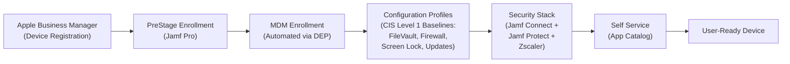
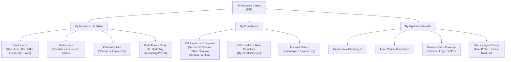
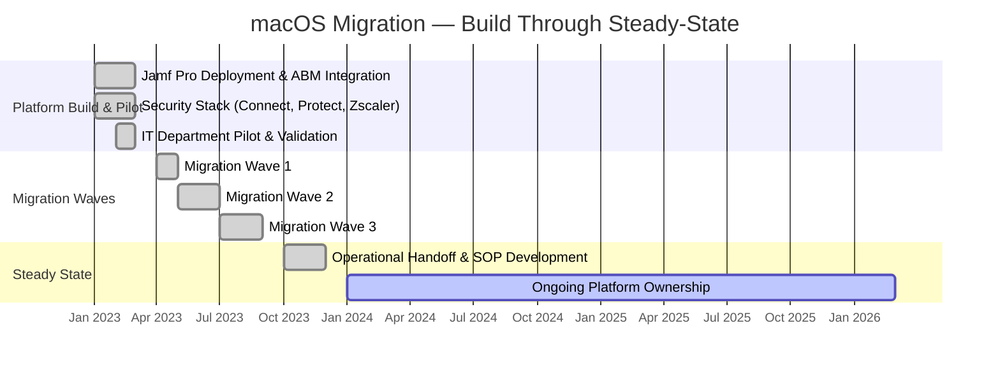

# Jamf Pro MDM Deployment

**Domain:** Endpoint Management  
**Role:** Platform Owner & Technical Lead  
**Timeline:** Q1 2023 – Q4 2023 (build through steady-state), ongoing platform ownership  

---

## Overview

Built an enterprise Jamf Pro MDM environment from the ground up to support a full-scale migration from Windows to macOS. This initiative converted a Microsoft Intune managed device fleet to a centrally governed macOS environment, enabling standardized configuration, automated enrollment, and policy-driven endpoint security across ~850 users.

---

## Environment

- **User base:** ~850 employees across multiple offices
- **Prior state:** Primarily Windows devices managed through Microsoft Intune
- **Target state:** Managed macOS fleet enrolled in Jamf Pro with standardized configuration profiles and automated device lifecycle
- **Identity provider:** Microsoft Entra ID
- **Security stack:** Jamf Connect (identity integration), Jamf Protect (endpoint security), Zscaler (network security)
- **Compliance context:** CIS Level 1 benchmarks for macOS hardening; HITRUST i1 certification in progress concurrently

---

## Problem Statement

The organization operated a Windows-based device fleet managed through Microsoft Intune. As the business evaluated macOS adoption for its workforce, there was no existing Apple MDM infrastructure, no Apple Business Manager integration, and no standardized process for macOS provisioning, configuration, or policy enforcement. The IT team needed to:

- Stand up an MDM platform capable of managing macOS at enterprise scale
- Design a zero-touch enrollment workflow for new device deployments
- Establish configuration and security baselines aligned with CIS Level 1 benchmarks
- Integrate identity, endpoint security, and network security tooling into the managed macOS environment
- Coordinate a phased migration that minimized end-user disruption across multiple business units

---

## Implementation

### Phase 1 — Platform Build-Out & Pilot (Q1 2023)

- Deployed Jamf Pro as the MDM authority for test macOS devices
- Integrated with Apple Business Manager (ABM) for automated device enrollment
- Configured PreStage Enrollment profiles to enable zero-touch provisioning
- Established identity integration with Microsoft Entra ID for directory-based scoping
- Deployed Jamf Connect for cloud identity binding at the macOS login window
- Deployed Jamf Protect for endpoint threat prevention and compliance monitoring
- Deployed Zscaler client for network security and web filtering on managed devices
- Piloted with IT department devices to validate enrollment, configuration, and security tooling end-to-end

### Phase 2 — Configuration & Policy Design

- Built configuration profiles for security baselines aligned with CIS Level 1 benchmarks: FileVault encryption, firewall policies, screen lock enforcement, and software update management
- Created Smart Groups for dynamic device segmentation across business units (Brooksource, Medasource, Calculated Hire, Eight Eleven Group), roles (Recruiters, AEs, AAEs, Leadership, Sales), and operational categories (IT, Help Desk, Marketing)
- Built compliance-focused Smart Groups to track CIS Level 1 conformance by macOS version (Tahoe, Sequoia, Sonoma, Ventura)
- Created operational Smart Groups for proactive monitoring: devices with low disk space, devices not checking in, FileVault encryption status, Jamf Protect installation status, Zscaler root CA presence, and browser patch currency (Chrome, Edge, Firefox)
- Developed Self Service policies to give end users access to approved applications without IT intervention
- Configured automated patch management policies for macOS and third-party applications

### Phase 3 — Migration Execution (Q2–Q3 2023)

- Coordinated migration waves across business units and departments, working with team leads and IT staff to schedule transitions
- Delivered standardized provisioning kits/workflows so new macOS devices arrived ready to enroll out of the box
- Validated that Jamf Connect, Jamf Protect, and Zscaler deployed successfully on each device post-enrollment
- Provided escalation support during migration waves to minimize downtime
- Tracked enrollment progress and compliance posture through Jamf Pro dashboards and Smart Groups

### Phase 4 — Steady-State Operations (Q4 2023 – Present)

- Established monitoring and alerting for enrollment failures, policy non-compliance, and certificate expiration
- Built SOPs for device provisioning, decommissioning, and lost/stolen device response
- Transitioned ongoing platform operations and help desk triage workflows to the support team
- Continue to manage and evolve Jamf Pro as platform owner — adding new Smart Groups, refining compliance baselines, and adjusting policies as the macOS fleet and security requirements evolve

---

## Architecture

```
┌─────────────────────────────────────────────────────────┐
│                  Apple Business Manager                   │
│              (Device Enrollment Program)                  │
└──────────────────────┬──────────────────────────────────┘
                       │ Automated Enrollment
                       ▼
┌─────────────────────────────────────────────────────────┐
│                      Jamf Pro                            │
│  ┌──────────────┐  ┌──────────────┐  ┌───────────────┐  │
│  │ PreStage     │  │ Config       │  │ Smart Groups  │  │
│  │ Enrollment   │  │ Profiles     │  │ & Scoping     │  │
│  └──────────────┘  └──────────────┘  └───────────────┘  │
│  ┌──────────────┐  ┌──────────────┐  ┌───────────────┐  │
│  │ Self Service │  │ Patch Mgmt   │  │ Compliance    │  │
│  │ Catalog      │  │ Policies     │  │ Reporting     │  │
│  └──────────────┘  └──────────────┘  └───────────────┘  │
└──┬───────────────────┬───────────────────┬──────────────┘
   │                   │                   │
   ▼                   ▼                   ▼
┌──────────────┐ ┌──────────────┐ ┌──────────────────┐
│ Jamf Connect │ │ Jamf Protect │ │    Zscaler       │
│ (Cloud IdP   │ │ (Endpoint    │ │ (Network Security│
│  Login)      │ │  Security)   │ │  & Web Filter)   │
└──────┬───────┘ └──────────────┘ └──────────────────┘
       │
       ▼
┌─────────────────────────────────────────────────────────┐
│               Microsoft Entra ID                         │
│        (Directory Sync / User Scoping)                   │
└─────────────────────────────────────────────────────────┘
```

---

## Enrollment Workflow



---

## Smart Group Segmentation



---

## Migration Timeline



---

## Tools & Technologies

| Category | Technology |
|---|---|
| MDM Platform | Jamf Pro |
| Device Enrollment | Apple Business Manager, PreStage Enrollment |
| Identity Integration | Microsoft Entra ID, Jamf Connect |
| Endpoint Security | Jamf Protect, FileVault, macOS Firewall, CIS Level 1 Benchmarks |
| Network Security | Zscaler |
| Software Distribution | Jamf Self Service, Patch Management Policies |
| Reporting | Jamf Pro Smart Groups, Dashboard Reporting |

---

## Results & Impact

- **~850 users** migrated from Windows/Intune to a fully managed macOS fleet within two quarters
- **Zero-touch provisioning** reduced per-device setup time from manual multi-hour processes to automated enrollment
- **CIS Level 1 compliance baselines** enforced across the fleet via configuration profiles, tracked by macOS version
- **Security stack (Jamf Connect + Jamf Protect + Zscaler)** deployed to every managed device as part of the enrollment workflow
- **70+ dynamic Smart Groups** built for business unit segmentation, compliance tracking, and proactive operational monitoring
- **Self Service catalog** reduced help desk ticket volume for common software requests
- **Audit-ready posture** contributed directly to HITRUST i1 certification evidence for endpoint controls
- **Operational handoff** documented with SOPs enabling the support team to manage day-to-day operations independently

---

## Suggested Screenshots to Include

| Screenshot | Why It Adds Value |
|---|---|
| Jamf Pro enrollment dashboard (redacted) | Demonstrates scale and operational oversight |
| PreStage Enrollment configuration page | Shows zero-touch provisioning design |
| CIS Level 1 configuration profile summary | Proves compliance-driven security enforcement |
| Smart Group criteria builder (business unit example) | Illustrates dynamic device segmentation logic |
| Jamf Connect login window | Shows cloud identity integration at the endpoint |
| Self Service app on a managed Mac | Shows the end-user software distribution experience |

> *Redact all organization names, serial numbers, usernames, and IP addresses before including any screenshots.*

---

[← Back to Portfolio](../README.md)
