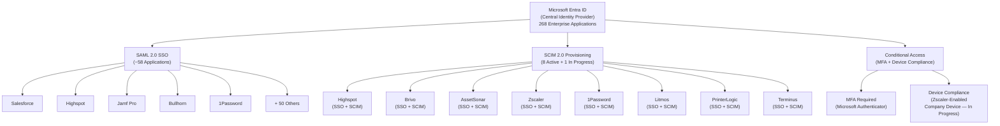
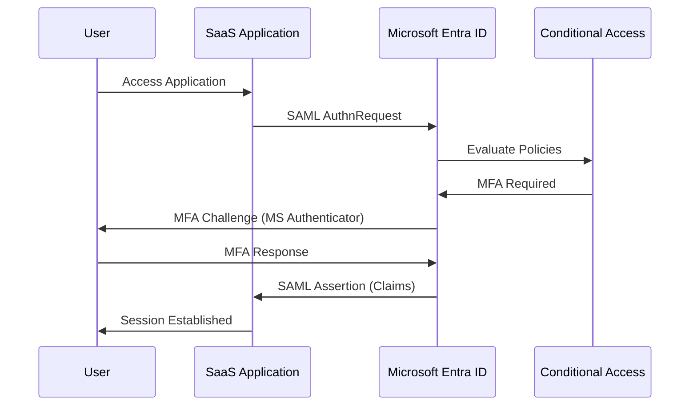
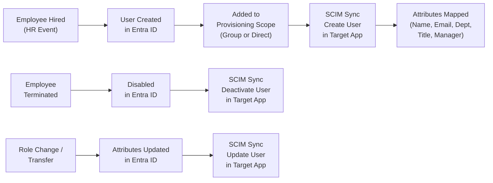
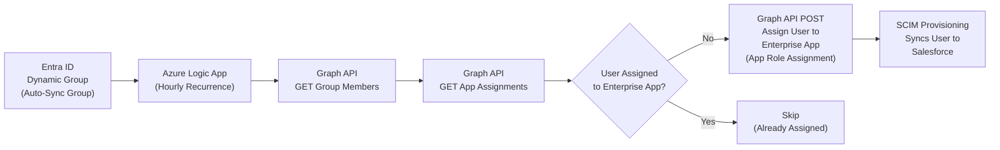

# SSO + SCIM Identity Automation

**Domain:** Identity & Access Management  
**Role:** Integration Owner & Technical Lead  
**Timeline:** Ongoing since June 2022, with continuous expansion  

---

## Overview

Designed and implemented SSO federation and SCIM-based lifecycle provisioning across the organization's SaaS portfolio using Microsoft Entra ID as the central identity provider. Starting with a single application (AssetSonar) as a Help Desk Analyst, expanded the organization's identity integration program to 58 SSO/SCIM-enabled applications — replacing manual account management with automated, directory-driven provisioning and centralized authentication across the enterprise.

---

## At a Glance

| Metric | Detail |
|---|---|
| Enterprise Applications in Entra ID | 268 total |
| SSO / SCIM Enabled Applications | ~58 |
| SSO Protocol | SAML 2.0 (majority) |
| SCIM Provisioning Active | 8 applications |
| SCIM In Progress | Salesforce (Azure Logic App + Graph API automation) |
| SSO-Only Applications | 10+ |
| Identity Provider | Microsoft Entra ID |
| Conditional Access | MFA enforced via Microsoft Authenticator; Zscaler-enabled device requirement in progress |
| User Base | ~850 employees |
| Ownership | Sole technical owner of Entra ID SSO/SCIM configurations |

---

## Architecture

---

## SSO Authentication Flow

---

## SCIM Provisioning Lifecycle

---

## Salesforce SCIM Automation Architecture

Salesforce's Entra ID SCIM connector only supports direct user assignment — not group-based provisioning scopes. To automate lifecycle provisioning at scale, designed and built an Azure Logic App workflow using the Microsoft Graph API to bridge this gap.

> 📄 **[Full Implementation Guide: Salesforce SCIM Provisioning & Logic App →](../docs/salesforce-scim-implementation.md)**

---

## Application Integration Matrix

| Application | SSO | SCIM | Notes |
|---|---|---|---|
| Highspot | ✅ | ✅ | Full SSO + SCIM implementation (Q3 2024 – Q1 2025) |
| Brivo | ✅ | ✅ | Physical access control identity integration |
| AssetSonar | ✅ | ✅ | First SSO/SCIM project (2022) |
| Zscaler | ✅ | ✅ | Network security identity integration |
| 1Password | ✅ | ✅ | Password manager provisioning |
| Litmos | ✅ | ✅ | LMS provisioning |
| PrinterLogic | ✅ | ✅ | Print management provisioning |
| Terminus / DemandScience | ✅ | ✅ | Marketing platform provisioning |
| Salesforce | ✅ | 🔄 | SCIM in progress — Azure Logic App + Graph API automating user assignment ([see implementation guide](../docs/salesforce-scim-implementation.md)) |
| Jamf Pro | ✅ | — | SSO only |
| Bullhorn | ✅ | — | SSO only |
| DocuSign | ✅ | — | SSO only |
| Loopio | ✅ | — | SSO only |
| LinkedIn Sales Nav / Recruiter | ✅ | — | SSO only |
| Indeed | ✅ | — | SSO only |
| Ironclad | ✅ | — | SSO only |
| RingCentral | ✅ | — | SSO only |
| ChatGPT | ✅ | — | SSO only |
| Claude | ✅ | — | SSO only |

---

## Tools & Technologies

| Category | Technology |
|---|---|
| Identity Provider | Microsoft Entra ID (268 Enterprise Applications) |
| SSO Protocol | SAML 2.0 |
| Provisioning Protocol | SCIM 2.0 |
| Access Policy | Conditional Access (MFA via Microsoft Authenticator) |
| Automation | Azure Logic Apps, Microsoft Graph API, PowerShell |
| Monitoring | Entra ID Provisioning Logs, Sign-In Logs |
| Device Compliance | Zscaler-enabled device requirement (in progress) |

---

## Screenshots

*Screenshots coming soon. Planned screenshots include:*

- *Entra ID Enterprise Applications list (redacted) — showing breadth of SSO integration*
- *SAML SSO configuration page for a target app — demonstrating federation setup*
- *SCIM provisioning attribute mapping — showing schema-level provisioning design*
- *Provisioning logs showing sync cycles — demonstrating operational monitoring*
- *Conditional Access policy summary — showing security posture enforcement*
- *Azure Logic App workflow designer — showing the Salesforce SCIM automation*

---

<strong>Click to expand full implementation breakdown</strong>

### Environment

- **Identity provider:** Microsoft Entra ID (268 registered Enterprise Applications, ~58 with SSO/SCIM)
- **User base:** ~850 employees
- **SSO targets:** 58+ applications including Salesforce, Highspot, Jamf Pro, Bullhorn, Zscaler, and others
- **Authentication protocol:** SAML 2.0 for SSO (majority of applications)
- **Provisioning protocol:** SCIM 2.0 for automated user lifecycle management
- **Adjacent systems:** Microsoft 365, Microsoft Intune, Jamf Pro

### Problem Statement

The organization relied on manual, ticket-based processes for SaaS user account creation, role assignment, and deactivation. This caused several operational problems:

- **Delayed onboarding:** New hires waited hours or days for access to critical applications
- **Orphaned accounts:** Departed employees retained active accounts in SaaS platforms due to inconsistent offboarding
- **Password sprawl:** Users maintained separate credentials for each application, increasing help desk ticket volume and security risk
- **Audit exposure:** No centralized record of who had access to what, creating gaps in compliance evidence

### Phase 1 — First SSO/SCIM Implementation (June 2022)

- Vetted IT asset management platforms through vendor demos and evaluation — selected AssetSonar based on MDM integration capabilities
- Took full ownership of the AssetSonar implementation, including configuring SSO and SCIM in Entra ID for the first time
- Registered AssetSonar as an Enterprise Application in Entra ID and configured SAML 2.0 federation
- Enabled SCIM 2.0 provisioning connector and mapped user attributes (name, email, department, title)
- Validated create, update, and deactivate operations before enabling production sync
- Established the pattern and documentation approach used for all subsequent SSO/SCIM integrations

### Phase 2 — Scaling SSO Across the SaaS Portfolio (2023–2024)

- Progressively onboarded applications to Entra ID SSO as the organization adopted new SaaS tools and as existing apps were brought under centralized identity management
- For each integration: registered the Enterprise Application in Entra ID, configured SAML 2.0 claims mapping, tested SSO flows in staging, coordinated user communication, and cut over to production
- Configured Conditional Access policies to enforce MFA via Microsoft Authenticator at sign-in for Microsoft services
- Worked directly with vendor support teams and documentation to ensure correct SAML configuration for each application
- Kept application stakeholders informed throughout each integration rollout
- Inherited several existing SSO integrations from the previous Systems Administrator and maintained/updated them as needed

### Phase 3 — SCIM Provisioning Expansion

- Enabled SCIM 2.0 provisioning for applications that supported it: Highspot, Brivo, AssetSonar, Zscaler, 1Password, Litmos, PrinterLogic, and Terminus/DemandScience
- Mapped Entra ID user attributes to each target application's schema (display name, email, department, title, manager)
- Configured group-based or direct-assignment provisioning scopes depending on application support
- Built provisioning validation workflows — tested create, update, and deactivate operations before enabling production sync for each app
- Established monitoring for provisioning cycle errors and quarantine events through Entra ID provisioning logs

### Highlight: Highspot SSO + SCIM (Q3 2024 – Q1 2025)

- Led the full SSO and SCIM implementation for Highspot, a sales enablement platform, from scoping through production deployment
- Configured SAML 2.0 SSO and SCIM 2.0 provisioning in Entra ID
- Coordinated with Highspot vendor support and internal stakeholders on attribute mapping and rollout timeline
- Delivered fully operational SSO + SCIM integration on deadline (Q1 2025)

### Highlight: Salesforce SCIM Automation (In Progress)

Salesforce's Entra ID SCIM connector only supports direct user assignment — it does not accept group-based provisioning scopes. This meant that every user needed to be individually assigned to the Enterprise Application in Entra ID before SCIM could provision them to Salesforce, making automated lifecycle management impractical at scale.

To solve this, designed and built an Azure Logic App workflow that bridges the gap:

- **Logic App** runs on an hourly recurrence, using a system-assigned managed identity authenticated against the Microsoft Graph API
- **Reads dynamic group membership** from a designated Entra ID sync group via Graph API
- **Compares against current Enterprise App assignments** to identify users who are in the group but not yet assigned to the app
- **Automatically creates app role assignments** via Graph API POST for any missing users, assigning them the Standard Platform User role
- **SCIM provisioning** then picks up the newly assigned users and syncs them to Salesforce as part of its normal provisioning cycle
- **Phased rollout plan** designed with a two-weekend deployment schedule: Weekend 1 for assignment migration and SSO validation, followed by a one-week monitoring period, then Weekend 2 for enabling SCIM provisioning
- **Graph API permissions** granted to the Logic App's managed identity via PowerShell: Application.Read.All, AppRoleAssignment.ReadWrite.All, Directory.Read.All, Group.ReadWrite.All, GroupMember.ReadWrite.All, User.Read.All
- **Full implementation guide with attribute mapping, rollback procedures, and testing criteria** documented for production deployment

> 📄 **[Full Implementation Guide →](../docs/salesforce-scim-implementation.md)**

### Phase 4 — Conditional Access & Device Compliance (Ongoing)

- Configured Conditional Access policies enforcing MFA via Microsoft Authenticator for all Microsoft services sign-ins
- Currently designing a BYOD restriction policy planned for 2026 rollout: Office apps will be restricted to mobile phones only for personal devices; all other sign-ins will require a Zscaler-enabled company-provided device
- Aligning Conditional Access policies with the broader zero-trust security model across endpoint, identity, and network layers

### Lifecycle Governance

- Aligned SCIM provisioning triggers with HR-driven lifecycle events (hire, transfer, termination)
- Created SOPs for exception handling — service accounts, shared mailboxes, and manual-override scenarios
- Documented integration architecture and attribute mapping for each connected application
- Compiled sign-in and provisioning logs as evidence for HITRUST i1 audit requirements

---

## Results & Impact

- **58 applications** integrated with SSO, SCIM, or both through Microsoft Entra ID — significantly expanding the organization's identity integration footprint from a handful of inherited integrations
- **8 applications with active SCIM provisioning** automating user create, update, and deactivate operations tied to directory lifecycle events
- **Salesforce SCIM in progress** with an Azure Logic App + Graph API solution to automate user provisioning beyond the connector's native limitations
- **SSO consolidated authentication** across the SaaS portfolio, eliminating per-app password management
- **SCIM provisioning reduced onboarding access delivery** from hours of manual account creation to automated sync within minutes
- **Orphaned account risk reduced** through automated deprovisioning tied to Entra ID lifecycle events
- **Conditional Access enforced** MFA via Microsoft Authenticator for all Microsoft services sign-ins
- **Zero-trust device compliance in progress** — Zscaler-enabled company device requirement and BYOD mobile-only restriction planned for 2026
- **Audit readiness improved** with centralized sign-in and provisioning logs contributing to HITRUST i1 certification evidence
- **Sole technical owner** of all Entra ID SSO and SCIM configurations across the organization

---

## Current Initiatives

- **Salesforce SCIM Automation** — Azure Logic App + Graph API workflow in testing to automate user provisioning to Salesforce, bypassing the direct-assignment-only limitation of the Entra ID SCIM connector ([full implementation guide](../docs/salesforce-scim-implementation.md))
- **BYOD Restriction Policy** — Conditional Access policy in design to restrict Office app access on personal devices to mobile only, with all other sign-ins requiring a Zscaler-enabled company device (planned 2026 rollout)
- **Continued SSO/SCIM Expansion** — Evaluating additional applications for SSO and SCIM onboarding as the SaaS portfolio grows

---

[← Back to Portfolio](../README.md)
